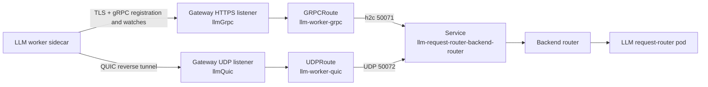

# Gateway Routing and DNS

This guide explains how NVCF self-hosted deployments route traffic through the
Kubernetes Gateway API, and how to configure DNS and HTTPS for production
environments.

## Overview

The NVCF self-hosted deployment uses the [Kubernetes Gateway API](https://gateway-api.sigs.k8s.io/) for ingress traffic management. This provides:

- Hostname-based routing for HTTP services (API Keys, NVCF API, Invocation)
- Port-based routing for gRPC and optional LLM reverse QUIC traffic
- One or more load balancers, based on the Gateway and listener layout
- Cross-namespace routing through `ReferenceGrant`

The Gateway API is a Kubernetes standard with multiple implementations. The
examples on this page use Envoy Gateway, but you can use any Gateway
API-compliant controller that supports the requirements below.

## Gateway quickstart

Use this procedure before any remote Helmfile deployment that needs NVCF
services reachable through Gateway API.

Skip this section for local k3d flows that already create the local Gateway and
route hostnames.

### Install Gateway API CRDs

Install the Kubernetes Gateway API CRDs v1.2.0:

```bash
kubectl apply -f https://github.com/kubernetes-sigs/gateway-api/releases/download/v1.2.0/experimental-install.yaml
```

If you replace v1.2.0 with another version, verify compatibility with the
GatewayClass and Gateway resources that you create.

### Create namespaces and labels

Create the namespaces used by the Gateway and NVCF services, then label the
route-owning namespaces so the Gateway can accept cross-namespace routes:

```bash
for namespace in envoy-gateway-system envoy-gateway api-keys ess sis nvcf; do
  kubectl create namespace "$namespace" --dry-run=client -o yaml | kubectl apply -f -
done

for namespace in envoy-gateway api-keys ess sis nvcf; do
  kubectl label namespace "$namespace" nvcf/platform=true --overwrite
done
```

### Install Envoy Gateway

Install Envoy Gateway as the Gateway API controller:

```bash
helm upgrade --install eg oci://docker.io/envoyproxy/gateway-helm \
  --version v1.1.3 \
  -n envoy-gateway-system
```

Verify the controller pod is running:

```bash
kubectl get pods -n envoy-gateway-system
```

### Create EnvoyProxy and GatewayClass

Create an `EnvoyProxy` resource before you create the `GatewayClass`. The
`envoyDeployment.replicas` setting controls the Envoy proxy data-plane pods that
handle ingress traffic. It does not control Envoy Gateway controller pods.

Service annotations on a `Gateway` do not configure the Envoy data-plane
Service. Set them in `EnvoyProxy.spec.provider.kubernetes.envoyService` so
Envoy Gateway copies them to the generated Service.

Before applying the `EnvoyProxy` on EKS, determine which Service controller
owns load balancers. Do not apply the manifest until you have selected the
matching `envoyService` configuration:

```bash
export EKS_CLUSTER_NAME="<cluster-name>"

aws eks describe-cluster --name "$EKS_CLUSTER_NAME" \
  --query 'cluster.kubernetesNetworkConfig.elasticLoadBalancing.enabled' \
  --output text
kubectl -n kube-system get deployment aws-load-balancer-controller
```

An EKS API result of `True` selects
[EKS Auto Mode](https://docs.aws.amazon.com/eks/latest/userguide/auto-configure-nlb.html).
Otherwise, a successful Deployment lookup selects the AWS Load Balancer
Controller. If neither is present, confirm that the cluster intentionally uses
the legacy AWS cloud provider Service controller, or install the AWS Load
Balancer Controller, before applying the example.

The applied manifest below uses the
[AWS Load Balancer Controller](https://kubernetes-sigs.github.io/aws-load-balancer-controller/latest/guide/service/nlb/)
with instance targets and an internet-facing Network Load Balancer (NLB).
For EKS Auto Mode, replace its `envoyService` map before applying it with:

```yaml
envoyService:
  loadBalancerClass: eks.amazonaws.com/nlb
  annotations:
    service.beta.kubernetes.io/aws-load-balancer-scheme: "internet-facing"
```

For the legacy AWS cloud provider Service controller, replace the map with:

```yaml
envoyService:
  annotations:
    service.beta.kubernetes.io/aws-load-balancer-type: "nlb"
```

The legacy controller creates an internet-facing load balancer by default. Add
`service.beta.kubernetes.io/aws-load-balancer-internal: "true"` for an internal
NLB. Do not combine the legacy `nlb` controller selector with the AWS Load
Balancer Controller target type and scheme annotations. The legacy controller
supports an NLB Service whose ports use only TCP or only UDP, but rejects one
Service that combines TCP and UDP ports. Use the AWS Load Balancer Controller
when the generated Envoy Service combines protocols. For another cloud
provider, replace the `envoyService` map with that provider's Service
configuration before applying it.

Create the `GatewayClass` with a `parametersRef` that points to the
`EnvoyProxy` resource:

```bash
kubectl apply -f - <<EOF
apiVersion: gateway.envoyproxy.io/v1alpha1
kind: EnvoyProxy
metadata:
  name: eg
  namespace: envoy-gateway-system
spec:
  provider:
    type: Kubernetes
    kubernetes:
      envoyService:
        annotations:
          service.beta.kubernetes.io/aws-load-balancer-type: "external"
          service.beta.kubernetes.io/aws-load-balancer-nlb-target-type: "instance"
          service.beta.kubernetes.io/aws-load-balancer-scheme: "internet-facing"
      envoyDeployment:
        replicas: 2
---
apiVersion: gateway.networking.k8s.io/v1
kind: GatewayClass
metadata:
  name: eg
spec:
  controllerName: gateway.envoyproxy.io/gatewayclass-controller
  parametersRef:
    group: gateway.envoyproxy.io
    kind: EnvoyProxy
    name: eg
    namespace: envoy-gateway-system
EOF
```

### Create Gateway

Create the Gateway resource with an HTTP listener on port 80, a TCP listener on
port 10081 for gRPC, and a TCP listener on port 4222 for NATS.

```bash
kubectl apply -f - <<EOF
apiVersion: gateway.networking.k8s.io/v1
kind: Gateway
metadata:
  name: nvcf-gateway
  namespace: envoy-gateway
spec:
  gatewayClassName: eg
  listeners:
  - name: http
    protocol: HTTP
    port: 80
    allowedRoutes:
      namespaces:
        from: Selector
        selector:
          matchLabels:
            nvcf/platform: "true"
  - name: tcp
    protocol: TCP
    port: 10081
    allowedRoutes:
      namespaces:
        from: Selector
        selector:
          matchLabels:
            nvcf/platform: "true"
  - name: nats
    protocol: TCP
    port: 4222
    allowedRoutes:
      namespaces:
        from: Selector
        selector:
          matchLabels:
            nvcf/platform: "true"
EOF
```

### gRPC worker callback listener

Split or multi-cluster gRPC invocation needs an additional TCP listener for the
worker callback path. Add this listener only when enabling split or
multi-cluster gRPC invocation.

```yaml
  - name: worker-tcp
    protocol: TCP
    port: 10086
    allowedRoutes:
      namespaces:
        from: Selector
        selector:
          matchLabels:
            nvcf/platform: "true"
```

The listener name must match
`ingress.gatewayApi.routes.grpcWorker.listenerName`.

<Warning>
The `grpcWorker` route is beta in 0.6.0. Enable it only when the control-plane
grpc-proxy runs one replica and the grpc-proxy HPA is disabled. Multiple
grpc-proxy replicas are not supported by this shared TCPRoute.

</Warning>

### LLM worker listeners

LLM workers in another cluster or region need a TLS-terminated HTTP/2 path for
gRPC registration and watches, plus a UDP path for the reverse QUIC tunnel.
These paths are separate from the `grpcWorker` callback route.



The following example uses separate Gateways so the infrastructure can create
one HTTPS load balancer and one UDP load balancer. A provider that supports
mixed HTTPS and UDP listeners can use one Gateway for both listeners. In that case,
set `llmGrpc.name` and `llmQuic.name` to the same Gateway name.

```bash
kubectl apply -f - <<EOF
apiVersion: gateway.networking.k8s.io/v1
kind: Gateway
metadata:
  name: llm-grpc-gateway
  namespace: envoy-gateway
spec:
  gatewayClassName: eg
  listeners:
  - name: llm-grpc
    protocol: HTTPS
    port: 50071
    tls:
      mode: Terminate
      certificateRefs:
      - kind: Secret
        name: llm-grpc-tls
    allowedRoutes:
      namespaces:
        from: Selector
        selector:
          matchLabels:
            nvcf/platform: "true"
---
apiVersion: gateway.networking.k8s.io/v1
kind: Gateway
metadata:
  name: llm-quic-gateway
  namespace: envoy-gateway
spec:
  gatewayClassName: eg
  listeners:
  - name: llm-quic
    protocol: UDP
    port: 50072
    allowedRoutes:
      namespaces:
        from: Selector
        selector:
          matchLabels:
            nvcf/platform: "true"
EOF
```

Enable the chart-owned routes and reference the listener names:

```yaml
ingress:
  gatewayApi:
    routes:
      llmWorker:
        enabled: true
        backend:
          namespace: nvcf
    gateways:
      llmGrpc:
        name: llm-grpc-gateway
        namespace: envoy-gateway
        listenerName: llm-grpc
      llmQuic:
        name: llm-quic-gateway
        namespace: envoy-gateway
        listenerName: llm-quic

addons:
  llm:
    pki:
      # Include the listener suffix when using the stack-managed issuer.
      allowedDomains: cluster.local,example.com
    requestRouter:
      grpcTls:
        enabled: true
        mode: certManager
        secretName: llm-grpc-tls
        dnsNames:
          - llm-grpc.example.com
        issuerRef:
          kind: ClusterIssuer
          name: nvcf-openbao-pki
```

The gateway-routes chart creates `GRPCRoute/llm-worker-grpc`,
`UDPRoute/llm-worker-quic`,
`ReferenceGrant/allow-llm-worker-routes`, a dedicated gRPC `Certificate`, and
an Envoy `BackendTrafficPolicy` with gRPC stream timeouts disabled. Both routes
target `Service/llm-request-router-backend-router` in the `nvcf` namespace on
ports `50071` and `50072`. The Service remains `ClusterIP` by design. Do not change
it to `LoadBalancer` or `NodePort`; the Gateway data-plane Service owns external
exposure.

The `GRPCRoute` deliberately omits `hostnames`, and its dedicated HTTPS
listener must omit `hostname`. The listener serves the dedicated certificate
for external-SNI verification, while Pylon keeps the selected Stargate pod
identity in HTTP/2 `:authority` so the backend router can forward each stream.
A listener hostname would constrain both values and reject the internal
authority. With `grpcTls.mode: existingSecret`, create the named Secret in the
Gateway namespace yourself; the chart renders no `Certificate`. Plaintext is
development-only and requires an explicit `http://` dial URI plus
`grpcTls.allowInsecureHttp: true`.

Configure worker-facing HTTPS and UDP dial addresses as described in
[Remote compute clusters and regions](./llm-function-enablement.md#remote-compute-clusters-and-regions).

### Capture Gateway values

Wait for the Gateway to be programmed and export the values used by the install
guides:

```bash
export HTTP_GATEWAY_NAMESPACE="envoy-gateway"
export HTTP_GATEWAY_NAME="nvcf-gateway"
export GRPC_GATEWAY_NAMESPACE="envoy-gateway"
export GRPC_GATEWAY_NAME="nvcf-gateway"

kubectl -n "$HTTP_GATEWAY_NAMESPACE" wait "gateway/$HTTP_GATEWAY_NAME" \
  --for=condition=Programmed=True --timeout=10m
kubectl -n "$GRPC_GATEWAY_NAMESPACE" wait "gateway/$GRPC_GATEWAY_NAME" \
  --for=condition=Programmed=True --timeout=10m

export GATEWAY_ADDR="$(kubectl -n "$HTTP_GATEWAY_NAMESPACE" get "gateway/$HTTP_GATEWAY_NAME" \
  -o jsonpath='{.status.addresses[0].value}')"
export GRPC_GATEWAY_ADDR="$(kubectl -n "$GRPC_GATEWAY_NAMESPACE" get "gateway/$GRPC_GATEWAY_NAME" \
  -o jsonpath='{.status.addresses[0].value}')"

test -n "$GATEWAY_ADDR" || exit 1
test -n "$GRPC_GATEWAY_ADDR" || exit 1
```

Use `GATEWAY_ADDR` as the route hostname suffix for test environments without
production DNS. Use your production domain instead when you configure DNS and
HTTPS.

## Use Gateway values with install paths

| Install path | Gateway values to use |
| --- | --- |
| [Quickstart](./quickstart.md) | Do not use these remote Gateway values. The quickstart uses local k3d route hostnames. |
| [Helmfile Installation](./helmfile-installation.md) | Use `GATEWAY_ADDR` as `global.domain`, and set `ingress.gatewayApi.gateways` to the Gateway names, namespaces, and listener names from Gateway quickstart. |

## Configure the CLI for Gateway access

For remote Helmfile deployments, configure the CLI after Gateway API ingress is
available. The CLI calls API, API Keys, invocation, and gRPC
endpoints during token minting, cluster registration, health checks, and
function operations.

```bash
export CLUSTER_NAME="nvcf-remote"
export NCA_ID="nvcf-default"
export REGION="us-west-1"
export STACK_DOMAIN="$GATEWAY_ADDR"

cat > .nvcf-cli.yaml <<EOF
base_http_url: "http://${GATEWAY_ADDR}"
invoke_url: "http://${GATEWAY_ADDR}"
base_grpc_url: "${GRPC_GATEWAY_ADDR}:10081"
api_keys_service_url: "http://${GATEWAY_ADDR}"

api_keys_host: "api-keys.${STACK_DOMAIN}"
api_host: "api.${STACK_DOMAIN}"
invoke_host: "invocation.${STACK_DOMAIN}"

api_keys_service_id: "nvidia-cloud-functions-ncp-service-id-aketm"
api_keys_issuer_service: "nvcf-api"
api_keys_owner_id: "svc@nvcf-api.local"

client_id: "${NCA_ID}"
EOF
```

Do not leave literal shell variables in the YAML. If you use production DNS and
HTTPS, set `STACK_DOMAIN` to your production domain and update the URL schemes
and ports accordingly.

## Gateway API Implementations

The `nvcf-gateway-routes` chart creates standard Kubernetes Gateway API
resources, including `HTTPRoute`, `GRPCRoute`, `TCPRoute`, `UDPRoute`, and
`ReferenceGrant`. Use a controller that supports every route kind enabled in
your environment.

Popular implementations include [Envoy Gateway](https://gateway.envoyproxy.io/) (used in our examples), [Istio](https://istio.io/latest/docs/tasks/traffic-management/ingress/gateway-api/), [Traefik](https://doc.traefik.io/traefik/routing/providers/kubernetes-gateway/), [Kong](https://developer.konghq.com/kubernetes-ingress-controller/gateway-api/), [Contour](https://projectcontour.io/docs/main/guides/gateway-api/), and cloud-native options like GKE Gateway Controller.

<Note>
There is no service mesh requirement. Envoy Gateway is not a service mesh. It is a Gateway API controller. You don't need service mesh features like mTLS between pods for NVCF to function. If you already have Istio or another service mesh, you can use its Gateway API support instead.

</Note>

### Minimum Requirements

Any Gateway API implementation you choose must support:

1. `HTTPRoute` for HTTP/HTTPS routing with hostname matching
2. `GRPCRoute` for HTTPS worker APIs and secure remote LLM registration
3. `TCPRoute` for gRPC invocation, optional split or multi-cluster gRPC
   invocation, and NATS routing (requires experimental Gateway API CRDs)
4. `UDPRoute` for remote LLM reverse tunnels when the `llmWorker` route is
   enabled (requires experimental Gateway API CRDs)
5. Cross-namespace routing and `ReferenceGrant` for routes that reference
   Services in another namespace

<Warning>
`TCPRoute` and `UDPRoute` are experimental. Some Gateway API implementations
have limited support for them. Verify the controller's supported versions
before deploying. Secure remote LLM workers require `GRPCRoute` and `UDPRoute`.

</Warning>

### Using a Different Implementation

To use a different Gateway API implementation instead of Envoy Gateway:

1. Install your chosen controller following its documentation

2. Create namespaces with `nvcf/platform=true` labels as shown in [Gateway quickstart](./gateway-routing.md#gateway-quickstart)

3. Create a `GatewayClass` for your controller

4. Create a `Gateway` with `http` (port 80), `tcp` (port 10081), and `nats`
   (port 4222) listeners. Add `worker-tcp` (port 10086) only when enabling
   split or multi-cluster gRPC invocation. Add `llm-grpc` (TCP port 50071) and
   `llm-quic` (UDP port 50072) when remote LLM workers use the Gateway.

5. Update your install configuration to reference your Gateway:

   ```yaml
   ingress:
     gatewayApi:
       enabled: true
       gateways:
         shared:
           name: your-gateway-name      # Your Gateway resource name
           namespace: your-namespace     # Namespace where Gateway exists
           listenerName: http            # HTTP listener name
         grpc:
           name: your-gateway-name       # Can be same Gateway with different listener
           namespace: your-namespace
           listenerName: tcp             # TCP listener name for gRPC
         nats:
           name: your-gateway-name       # Can be same Gateway with different listener
           namespace: your-namespace
           listenerName: nats            # TCP listener name for NATS
         llmGrpc:
           name: your-llm-grpc-gateway   # Gateway with the TCP port 50071 listener
           namespace: your-namespace
           listenerName: llm-grpc
         llmQuic:
           name: your-llm-quic-gateway   # Gateway with the UDP port 50072 listener
           namespace: your-namespace
           listenerName: llm-quic
   ```

The `nvcf-gateway-routes` chart creates the enabled routes and attaches them to
the configured Gateways and listeners.

### Not Using Gateway API

While technically possible to bypass the Gateway API entirely, this is not recommended:

- The `nvcf-gateway-routes` chart specifically creates Gateway API resources
- You would need to manually create and maintain all routing configuration
- Traditional Kubernetes Ingress does not provide `TCPRoute` or `UDPRoute`
- Multiple LoadBalancer services would require multiple external IPs

If you have a specific requirement that prevents using Gateway API, you would need to:

1. Disable `nvcf-gateway-routes` in your helmfile
2. Create your own Ingress or Service resources for each NVCF service
3. Configure hostname routing manually
4. Set up TCP load balancers for gRPC on port 10081, optional split or
   multi-cluster gRPC invocation on port 10086, and NATS on port 4222
5. When serving remote LLM workers, terminate verified TLS with ALPN `h2` on
   port 50071 and forward h2c to `llm-request-router-backend-router`; route UDP
   port 50072 to the same Service without bypassing its authority and SNI
   selection

## Gateway Architecture

### Components

The gateway architecture consists of two layers:

### User-configured resources

These resources must be created manually before deploying the control plane:

- Namespaces with `nvcf/platform=true` labels
- Gateway API controller installation (Envoy Gateway, Istio, Traefik, etc.)
- `GatewayClass` resource
- `Gateway` resource with `http` (port 80), `tcp` (port 10081), and `nats`
  (port 4222) listeners
- Optional `worker-tcp` (port 10086) listener for split or multi-cluster gRPC
  invocation
- Optional `llm-grpc` (HTTPS port 50071) and `llm-quic` (UDP port 50072)
  listeners for remote LLM workers

### Resources created by nvcf-gateway-routes

When you deploy the control plane via helmfile, the `nvcf-gateway-routes` chart automatically creates:

- `HTTPRoutes` for API Keys, NVCF API, and Invocation services
- Optional LLM invocation HTTPRoute when the `llmInvocation` route is enabled
- Optional Vanity Gateway HTTPRoute only when the stack package includes the addon and the `vanityGateway` route is enabled
- Optional NVCF UI HTTPRoute only when the stack package includes the addon and the `nvcfUi` route is enabled
- `TCPRoute` for gRPC
- Optional `TCPRoute` for split or multi-cluster gRPC invocation when the
  `grpcWorker` route is enabled
- Optional `TCPRoute` for NATS when the `nats` route is enabled
- Optional `GRPCRoute`, `UDPRoute`, gRPC listener `Certificate` in cert-manager
  mode, and Envoy stream timeout policy for LLM worker traffic when the
  `llmWorker` route is enabled
- `ReferenceGrants` for cross-namespace routing permissions

These routes attach to the Gateway you prepared in [Gateway quickstart](./gateway-routing.md#gateway-quickstart).

### Route Configuration

| Service | Hostname Pattern | Listener Port | Description |
| --- | --- | --- | --- |
| API Keys | `api-keys.<domain>` | 80 | Token generation and API key management |
| NVCF API | `api.<domain>` | 80 | Function management (create, deploy, delete) |
| Invocation | `invocation.<domain>`, `*.invocation.<domain>` | 80 | Function invocation (wildcard for dynamic routing) |
| LLM Invocation | `llm.invocation.<domain>` | 80 | OpenAI-compatible LLM invocation routes such as `/v1/chat/completions`, `/v1/responses`, and `/v1/embeddings` |
| Vanity Gateway | `vanity.<domain>` | 80 | Optional vanity host/path routing to `vanity-gateway.nvcf:8080`, only in stack packages that include the addon |
| NVCF UI | `nvcf-ui.<domain>` | 80 | Optional nvcf-ui host/path routing to `nvcf-ui.nvcf-ui:8300`, only in stack packages that include the addon |
| gRPC | N/A (TCP routing, no hostname matching) | 10081 | gRPC function invocations |
| gRPC worker callback | N/A (TCP routing, no hostname matching) | 10086 | HTTP/1 CONNECT callback from workers to grpc-proxy when the beta `grpcWorker` route is enabled |
| NATS | N/A (TCP routing, no hostname matching) | 4222 | NVCA messaging when the NATS route is enabled |
| LLM worker gRPC | External TLS SNI; Stargate identity remains `:authority` | 50071 | TLS-terminated registration and request-router watches through `llm-request-router-backend-router` |
| LLM worker QUIC | N/A (UDP routing, SNI selects a request-router pod) | 50072 | Reverse inference tunnels through `llm-request-router-backend-router` |

<Note>
The `<domain>` is your Gateway's load balancer address (e.g., `a1b2c3d4.us-west-2.elb.amazonaws.com`) or your custom domain. The helmfile deployment automatically configures the HTTPRoute hostnames using this value from your environment configuration.

</Note>

<Tip>
When the LLM invocation route is enabled in self-managed deployments, send OpenAI-compatible requests to `http://${GATEWAY_ADDR}/v1/...` with `Host: llm.invocation.${GATEWAY_ADDR}` and set `model` to `<function-id>/<model-name>`.

</Tip>

### Invocation Path Diagrams

For local and multi-cluster invocation-path diagrams, see
[Generic HTTP Function Invocation](./generic-http-function-invocation.md),
[gRPC Function Invocation](./grpc-function-invocation.md), and
[LLM Gateway](./llm-gateway.md).

### Vanity Gateway (Optional)

Vanity Gateway is disabled by default. It is available only in stack packages
that include the Vanity Gateway addon. If your extracted stack package does not
contain a `vanity-gateway` release and `vanityGateway` route values, skip this
section until you use a stack package that includes them.

Enable it only when you need a customer-facing hostname or mapping layer in
front of the standard NVCF service routes. In Helmfile-based stack packages that
include the addon, set:

```yaml
addons:
  vanityGateway:
    enabled: true
    mappingConfig: {}
```

By default, the route host is `vanity.<domain>` and the backend is
`vanity-gateway.nvcf:8080`. Use `addons.vanityGateway.mappingConfig` for the
host and path mappings required by your deployment. If you need custom vanity
hostnames instead of `vanity.<domain>`, configure the route hostname overrides
supported by your stack package, then create matching DNS records for those
hosts.

### NVCF UI (Optional)

NVCF UI is optional and disabled by default. It is available only in
stack packages that include the NVCF UI addon. If your extracted stack
package does not contain a `nvcf-ui` release and `nvcfUi` route
values, skip this section until you use a stack package that includes them.

Enable it only when you need a customer-facing NVCF admin-panel UI.

<Warning>
The NVCF UI admin panel is currently unauthenticated. Do not expose it to the
public internet. Restrict access to a trusted network, VPN, or an
authenticating proxy in front of the `nvcf-ui` route.
</Warning>

In stack packages that include the addon, set the value shape in your
environment file:

```yaml
addons:
  nvcfUi:
    enabled: true
```

By default, the route host is `nvcf-ui.<domain>` and the backend is
`nvcf-ui.nvcf-ui:8300`.

### How Routing Works

1. The main Gateway's LoadBalancer Service exposes ports 80 (HTTP), 10081
   (gRPC), and 4222 (NATS) externally.
2. HTTP requests arrive at port 80. The Gateway inspects the `Host` header and matches it against HTTPRoute hostnames.
3. The matching HTTPRoute forwards the request to the appropriate backend service (e.g., `api-keys` service on port 8080).
4. gRPC requests arrive at port 10081. The TCPRoute forwards all traffic directly to the `grpc` service. No hostname matching is required.
5. NATS connections arrive at port 4222. When enabled, the NATS TCPRoute
   forwards traffic directly to the NATS service.
6. Remote LLM gRPC connections arrive at the configured `llmGrpc` listener.
   The listener verifies and terminates TLS, then the GRPCRoute forwards h2c to
   the backend-router Service on port 50071 without changing `:authority`.
7. Remote LLM reverse tunnels arrive at the configured `llmQuic` listener.
   The UDPRoute forwards them to the same Service on port 50072. The TCP and
   UDP listeners can use separate Gateways and load balancers.

<Tip>
gRPC doesn't need Host headers because it uses a dedicated TCP listener on port 10081. The gateway routes all traffic on that port directly to the gRPC service without hostname matching.

</Tip>

## Verifying Gateway Configuration

After deploying the control plane, use these commands to verify your gateway configuration.

### Get the Gateway Load Balancer Address

```bash
# Get the gateway's external address (hostname or IP)
export GATEWAY_ADDR=$(kubectl get gateway nvcf-gateway -n envoy-gateway \
  -o jsonpath='{.status.addresses[0].value}')
echo "Gateway Address: $GATEWAY_ADDR"
```

### Verify HTTPRoute Hostnames

The gateway routes requests based on the `Host` header. Check what hostnames are configured:

```bash
# List all HTTPRoutes and their hostnames
kubectl get httproute -A -o jsonpath='{range .items[*]}{.metadata.name}: {.spec.hostnames[*]}{"\n"}{end}'

# Example output:
# api-keys: api-keys.a1b2c3d4.us-west-2.elb.amazonaws.com
# nvcf-api: api.a1b2c3d4.us-west-2.elb.amazonaws.com
# invocation-service: *.invocation.a1b2c3d4.us-west-2.elb.amazonaws.com invocation.a1b2c3d4.us-west-2.elb.amazonaws.com
# vanity-gateway: vanity.a1b2c3d4.us-west-2.elb.amazonaws.com  # only when enabled and present in the stack package
```

If Vanity Gateway is disabled or your stack package does not include the addon,
the `vanity-gateway` HTTPRoute is not expected.

### Verify TCPRoutes

```bash
# Check gRPC and NATS routing is configured
kubectl get tcproute -A
# Expected output:
# NAMESPACE       NAME   AGE
# envoy-gateway   grpc   19h
# envoy-gateway   nats   19h  # when the NATS route is enabled

# Verify the gateway exposes ports 10081 and 4222
kubectl get svc -n envoy-gateway-system -l gateway.envoyproxy.io/owning-gateway-name=nvcf-gateway \
  -o jsonpath='{.items[0].spec.ports[*].port}'
# Expected output includes: 80 10081 4222
```

### Verify LLM worker routes

After applying the stack with `llmWorker.enabled: true`, verify both route
parents and the cross-namespace backend reference:

```bash
export LLM_GRPC_GATEWAY_NAMESPACE=envoy-gateway
export LLM_QUIC_GATEWAY_NAMESPACE=envoy-gateway

kubectl -n "$LLM_GRPC_GATEWAY_NAMESPACE" get grpcroute llm-worker-grpc \
  -o jsonpath='{range .status.parents[*].conditions[*]}{.type}={.status}{" reason="}{.reason}{"\n"}{end}'
kubectl -n "$LLM_QUIC_GATEWAY_NAMESPACE" get udproute llm-worker-quic \
  -o jsonpath='{range .status.parents[*].conditions[*]}{.type}={.status}{" reason="}{.reason}{"\n"}{end}'
kubectl -n nvcf get referencegrant allow-llm-worker-routes -o yaml
# cert-manager mode only
kubectl -n "$LLM_GRPC_GATEWAY_NAMESPACE" get certificate llm-grpc-tls
kubectl -n "$LLM_GRPC_GATEWAY_NAMESPACE" get backendtrafficpolicy \
  llm-worker-grpc-streams \
  -o jsonpath='{.spec.timeout.http.requestTimeout}{"\n"}'
kubectl -n nvcf get service llm-request-router-backend-router \
  -o jsonpath='{.spec.type}{"\t"}{range .spec.ports[*]}{.port}{"/"}{.protocol}{" "}{end}{"\n"}'
```

Each route parent must report `Accepted=True` and `ResolvedRefs=True`. The
Service type must remain `ClusterIP`, with TCP port `50071` and UDP port
`50072`. In cert-manager mode the dedicated certificate must be Ready, and
the request timeout must be `0s`. This is the Envoy Gateway v1.5-compatible
setting that disables the default 15-second timeout for streaming gRPC calls.
Also wait for each referenced Gateway to report
`Programmed=True` and confirm that its status contains an external address.
Verify the public certificate and ALPN without disabling validation:

```bash
openssl s_client -connect llm-grpc.example.com:50071 \
  -servername llm-grpc.example.com -alpn h2 -verify_return_error \
  -CAfile /path/to/worker-trust-bundle.pem </dev/null
```

Route status proves that the controller accepted the configuration. It does
not prove that firewall rules, cross-region routing, DNS, or UDP forwarding
work from a compute cluster. Test both external endpoints from every worker
network before deploying production LLM functions.

### Test Connectivity

```bash
# Test HTTP endpoints with Host header
curl -H "Host: api-keys.$GATEWAY_ADDR" http://$GATEWAY_ADDR/health
curl -H "Host: api.$GATEWAY_ADDR" http://$GATEWAY_ADDR/health

# Optional Vanity Gateway route, only if the addon is present and enabled
curl -H "Host: vanity.$GATEWAY_ADDR" http://$GATEWAY_ADDR/health

# Test gRPC endpoint (requires grpcurl)
grpcurl -plaintext $GATEWAY_ADDR:10081 grpc.health.v1.Health/Check
```

## Development: Host Header Routing

For development and testing when you don't have DNS configured, you can use Host header overrides to route requests through the gateway.

### Why Host Headers Are Needed

The Envoy Gateway uses hostname-based routing to direct traffic to different backend services through a single load balancer. When you send a request to the raw load balancer address (e.g., `http://a1b2c3d4.elb.amazonaws.com`), the gateway needs to know which service to route to.

Without the correct `Host` header, the gateway cannot match the request to an HTTPRoute and returns 404.

<Note>
The NVCA agent on a self-managed GPU cluster has the same requirement when it reaches the
control plane through a load-balancer-fronted gateway. Configure its host-header overrides
in the operator values, not the CLI config. See
[self-managed-clusters](./cluster-management/self-managed.md).

</Note>

<Warning>
Host header routing only works with plaintext HTTP traffic. Without TLS/SNI spoofing support in your client, you cannot use HTTPS with this method. The TLS handshake occurs before the Host header is sent, so the server cannot route based on a custom Host header when using HTTPS. For encrypted traffic, use proper DNS records as described in [production-dns-https](./gateway-routing.md).

</Warning>

### Configuring Host Headers

When using tools that support custom Host headers (like the NVCF CLI or curl), specify the expected hostname:

```bash
# Example: curl with Host header override
curl -H "Host: api-keys.a1b2c3d4.us-west-2.elb.amazonaws.com" \
  http://a1b2c3d4.us-west-2.elb.amazonaws.com/v1/admin/keys
```

For the NVCF CLI, configure the `*_host` settings in your configuration file:

```yaml
# Endpoints point to load balancer
base_http_url: "http://a1b2c3d4.us-west-2.elb.amazonaws.com"
invoke_url: "http://a1b2c3d4.us-west-2.elb.amazonaws.com"
api_keys_service_url: "http://a1b2c3d4.us-west-2.elb.amazonaws.com"
base_grpc_url: "a1b2c3d4.us-west-2.elb.amazonaws.com:10081"

# Host header overrides for routing
api_keys_host: "api-keys.a1b2c3d4.us-west-2.elb.amazonaws.com"
api_host: "api.a1b2c3d4.us-west-2.elb.amazonaws.com"
invoke_host: "invocation.a1b2c3d4.us-west-2.elb.amazonaws.com"
```

See [cli-configuration](./cli.md) for complete CLI configuration documentation.

## Production: DNS and HTTPS

For production deployments, configure proper DNS and TLS to eliminate the need for Host header overrides.

### Benefits

With proper DNS and HTTPS:

- DNS records resolve service hostnames (e.g., `api-keys.nvcf.example.com`) to your Gateway's load balancer
- TLS certificates secure all traffic
- Clients use simple URLs without Host header overrides
- Browsers and other clients can access services directly

### Step 1: Choose a Domain

Select a domain you control for your NVCF deployment:

```text
# Example domain structure
nvcf.example.com                    # Base domain
|-- api-keys.nvcf.example.com       # API Keys service
|-- api.nvcf.example.com            # NVCF API
|-- invocation.nvcf.example.com     # Invocation service
|-- *.invocation.nvcf.example.com   # Wildcard for function routing
`-- grpc.nvcf.example.com           # gRPC endpoint (optional, for documentation)
```

### Step 2: Create DNS Records

Create DNS records pointing to your Gateway's load balancer address:

```text
# A/CNAME records (replace with your load balancer address)
api-keys.nvcf.example.com     -> a1b2c3d4.us-west-2.elb.amazonaws.com
api.nvcf.example.com          -> a1b2c3d4.us-west-2.elb.amazonaws.com
invocation.nvcf.example.com   -> a1b2c3d4.us-west-2.elb.amazonaws.com
*.invocation.nvcf.example.com -> a1b2c3d4.us-west-2.elb.amazonaws.com
```

### AWS Route 53 example

```bash
# Get your Gateway load balancer address
GATEWAY_ADDR=$(kubectl get gateway nvcf-gateway -n envoy-gateway \
  -o jsonpath='{.status.addresses[0].value}')

# Create CNAME records (example using AWS CLI)
aws route53 change-resource-record-sets --hosted-zone-id YOUR_ZONE_ID --change-batch '{
  "Changes": [
    {"Action": "CREATE", "ResourceRecordSet": {"Name": "api-keys.nvcf.example.com", "Type": "CNAME", "TTL": 300, "ResourceRecords": [{"Value": "'$GATEWAY_ADDR'"}]}},
    {"Action": "CREATE", "ResourceRecordSet": {"Name": "api.nvcf.example.com", "Type": "CNAME", "TTL": 300, "ResourceRecords": [{"Value": "'$GATEWAY_ADDR'"}]}},
    {"Action": "CREATE", "ResourceRecordSet": {"Name": "invocation.nvcf.example.com", "Type": "CNAME", "TTL": 300, "ResourceRecords": [{"Value": "'$GATEWAY_ADDR'"}]}}
  ]
}'
```

<Tip>
Automate with external-dns. The `nvcf-gateway-routes` chart supports `routeAnnotations` for automatic DNS record creation via [external-dns](https://github.com/kubernetes-sigs/external-dns). See the chart's README for configuration examples.

</Tip>

### Step 3: Update HTTPRoute Hostnames

Update your helmfile environment to use your custom domain instead of the load balancer address:

```yaml
# Use your custom domain
domain: "nvcf.example.com"

# Gateway configuration remains the same
ingress:
  gatewayApi:
    enabled: true
    gateways:
      shared:
        name: nvcf-gateway
        namespace: envoy-gateway
        listenerName: http
      grpc:
        name: nvcf-gateway
        namespace: envoy-gateway
        listenerName: tcp
      nats:
        name: nvcf-gateway
        namespace: envoy-gateway
        listenerName: nats
```

Redeploy to update the HTTPRoute hostnames:

```bash
helmfile -e <env> apply
```

Verify the routes updated:

```bash
kubectl get httproute -A -o jsonpath='{range .items[*]}{.metadata.name}: {.spec.hostnames[*]}{"\n"}{end}'
# Expected:
# api-keys: api-keys.nvcf.example.com
# nvcf-api: api.nvcf.example.com
# invocation-service: *.invocation.nvcf.example.com invocation.nvcf.example.com
```

### Step 4: Configure TLS (HTTPS)

For TLS, you have two main options:

### Option A: TLS at the Load Balancer (recommended for AWS)

Terminate TLS at the AWS NLB using ACM certificates:

1. Request a certificate in AWS Certificate Manager for `*.nvcf.example.com`
2. Update the Gateway to use HTTPS listeners

```yaml
# Update Gateway listeners for TLS passthrough or termination
# This varies by cloud provider - consult your provider's documentation
```

### Option B: TLS at the Gateway with cert-manager

Use cert-manager to automatically provision Let's Encrypt certificates:

```bash
# Install cert-manager
kubectl apply -f https://github.com/cert-manager/cert-manager/releases/download/v1.14.0/cert-manager.yaml

# Create a ClusterIssuer for Let's Encrypt
kubectl apply -f - <<EOF
apiVersion: cert-manager.io/v1
kind: ClusterIssuer
metadata:
  name: letsencrypt-prod
spec:
  acme:
    server: https://acme-v02.api.letsencrypt.org/directory
    email: your-email@example.com
    privateKeySecretRef:
      name: letsencrypt-prod
    solvers:
    - http01:
        gatewayHTTPRoute:
          parentRefs:
          - name: nvcf-gateway
            namespace: envoy-gateway
EOF
```

Then update your Gateway to use HTTPS listeners with the certificate secret.

### Step 5: Update Client Configuration

With DNS and HTTPS configured, client configurations simplify significantly:

```yaml
# Simple URLs using your domain - no Host header overrides needed!
base_http_url: "https://api.nvcf.example.com"
invoke_url: "https://invocation.nvcf.example.com"
base_grpc_url: "grpc.nvcf.example.com:443"
api_keys_service_url: "https://api-keys.nvcf.example.com"

# No host header overrides required - DNS handles routing
# api_keys_host: ""  # Not needed
# api_host: ""       # Not needed
# invoke_host: ""    # Not needed
```

## Development vs Production Comparison

| Aspect | Development (Host Headers) | Production (DNS/HTTPS) |
| --- | --- | --- |
| DNS Required | No | Yes |
| TLS/HTTPS | Optional (HTTP works) | Recommended |
| Client Config | Requires `*_host` overrides | Simple URLs only |
| Browser Access | Difficult (requires manual headers) | Works normally |
| Setup Complexity | Low (immediate testing) | Higher (DNS + certs) |

## Troubleshooting

### 404 Errors

If you receive 404 errors when accessing services:

1. Verify the Host header matches the HTTPRoute hostname:

   ```bash
   kubectl get httproute api-keys -n envoy-gateway -o jsonpath='{.spec.hostnames}'
   ```

2. Confirm the gateway is programmed:

   ```bash
   kubectl get gateway nvcf-gateway -n envoy-gateway -o jsonpath='{.status.conditions}'
   ```

3. Check route attachment:

   ```bash
   kubectl describe httproute api-keys -n envoy-gateway | grep -A 5 "Parents"
   ```

### Routes Not Attaching

If routes show 0 attached in gateway status:

1. Verify namespace labels:

   ```bash
   kubectl get ns -l nvcf/platform=true
   ```

2. Check `ReferenceGrants` exist:

   ```bash
   kubectl get referencegrants -A
   ```

3. Review gateway listener configuration:

   ```bash
   kubectl get gateway nvcf-gateway -n envoy-gateway -o yaml | grep -A 20 listeners
   ```

### gRPC Connection Issues

For gRPC connection problems:

1. Verify port 10081 is exposed:

   ```bash
   kubectl get svc -n envoy-gateway-system -l gateway.envoyproxy.io/owning-gateway-name=nvcf-gateway
   ```

2. Test with `grpcurl`:

   ```bash
   grpcurl -plaintext $GATEWAY_ADDR:10081 list
   ```

3. Check `TCPRoute` status:

   ```bash
   kubectl describe tcproute grpc -n envoy-gateway
   ```

## Related Documentation

- [helmfile-installation](./helmfile-installation.md) - Helmfile values that consume Gateway quickstart outputs
- [cli-configuration](./cli.md) - CLI configuration including Host header settings
- [Kubernetes Gateway API](https://gateway-api.sigs.k8s.io/)
- [Envoy Gateway](https://gateway.envoyproxy.io/)
